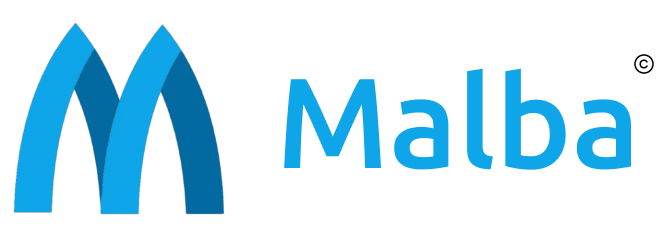
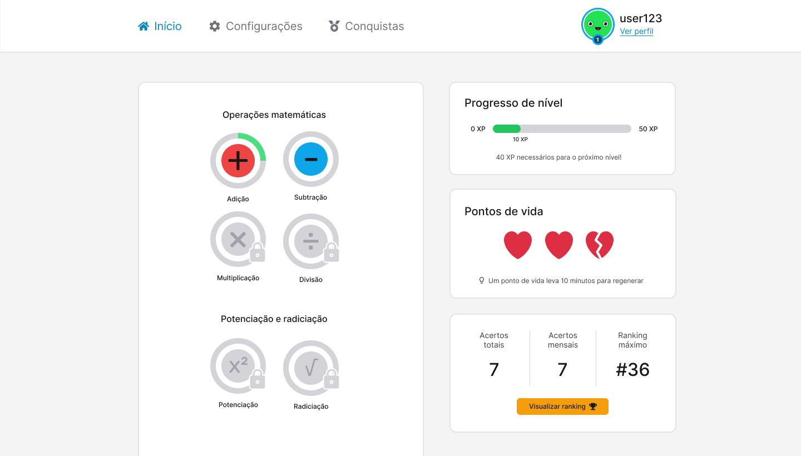

<div align="center">

  

Um website para ensino de Matemática básica

  

</div>

# Sumário

- [Introdução](#introducao)
- [Documentação](#documentação)
  - [UML](#uml)
  - [Banco de dados](#banco)
  - [Design e Protótipo](#prototipo)
  - [Tecnologias](#tecnologias)
- [Instalação](#instalacao)
  - [Pré-requisitos](#requisitos)
  - [Frontend](#frontend)
  - [Backend](#backend)

<h1 id="introducao">Introdução</h1>

Malba é um website voltado para o ensino de Matemática básica, com um sistema de séries de lições, progressão de nível e recompensas, fortemente inspirado na plataforma [Duolingo](https://www.duolingo.com/).

Foi desenvolvido como Projeto Interdisciplinar do terceiro semestre do Curso Superior de Tecnologia em Análise e Desenvolvimento de Sistemas do [Instituto Federal de São Paulo — Campus Boituva](https://btv.ifsp.edu.br), contemplando as disciplinas: Análise Orientada a Objetos, Banco de Dados II e Programação Web.

<h1 id="documentacao">Documentação</h1>

[Clique aqui](https://github.com/rafaeldiehl/malba/tree/main/docs) para acessar o diretório com a documentação completa.

<h2 id="uml">UML</h2>

O projeto contém os seguintes [diagramas UML](https://github.com/rafaeldiehl/malba/tree/main/docs/uml) na sua documentação:

- Diagrama de Casos de Uso;
- Diagrama de Classes;
- Diagramas de Sequência, para cada caso de uso;
- Diagrama de Componentes;
- Diagrama de Implantação.

<h2 id="banco">Banco de Dados</h2>

Os principais modelos do [banco de dados](https://github.com/rafaeldiehl/malba/tree/main/docs/banco) também estão disponíveis no repositório:

- Modelo conceitual;
- Modelo lógico;
- Modelo físico.

<h2 id="prototipo">Design e Protótipo</h2>

O design e protótipo interativo do sistema pode ser acesso pelo [Figma](https://www.figma.com/file/FMZNLPG7E6dZjupipOozBw/Malba?node-id=0%3A1).

<h2 id="tecnologias">Tecnologias</h2>

As tecnologias usados no projeto foram:

### Frontend

- [HTML](https://developer.mozilla.org/pt-BR/docs/Web/HTML);
- [JavaScript](https://developer.mozilla.org/pt-BR/docs/Web/JavaScript);
- [Vue](https://vuejs.com);
- [Vuex](https://vuex.vuejs.org);
- [Tailwind](https://tailwindcss.com);
- [Sass](https://sass-lang.com);
- [PostCSS](https://postcss.org);
- [Axios](https://axios-http.com).

### Backend

- [PHP](https://www.php.net);
- [Laravel](https://laravel.com).

### Banco de Dados

- [MySQL](https://www.mysql.com).

### Manutenção do Código

- [Git](https://git-scm.com);
- [Github](https://github.com/rafaeldiehl/malba/);
- [Visual Studio Code](https://code.visualstudio.com).

### Gerenciamento de Pacotes

- [NPM](https://www.npmjs.com);
- [Composer](https://getcomposer.org).

### Prototipação e Modelagem

- [Figma](https://www.figma.com);
- [Diagrams.net](https://app.diagrams.net).

<h1 id="instalacao">Instalação</h1>

Siga os passos abaixo para rodar o projeto localmente.

<h2 id="requisitos">Pré-requisitos</h2>

Antes de começar, você vai precisar ter instalado em sua máquina as seguintes ferramentas:

- [Git](https://git-scm.com);
- [NPM](https://www.npmjs.com);
- [PHP](https://www.php.net);
- [Composer](https://getcomposer.org).

Caso esteja usando Windows, você pode facilmente instalar PHP usando a ferramenta [Xampp](https://www.apachefriends.org/download.html). Além disto é bom ter um editor para trabalhar com o código como [Visual Studio Code](https://code.visualstudio.com) ou [Sublime Text 3](https://www.sublimetext.com/3).

Com as ferramentas adequadamente instaladas, clone o repositório com o seguinte comando e acesse o diretório raiz:

```bash
# Clone o repositório
$ git clone https://github.com/rafaeldiehl/malba.git

# Acesse o diretório raiz
$ cd malba/
```

<h2 id="frontend">Frontend</h2>

Para rodar o frontend, execute os seguintes comandos (certifique-se de estar no diretório raiz do projeto):

```bash
# Acesse o diretório frontend
$ cd frontend/

# Instale as dependências necessárias
$ npm i

# Rode o servidor local
$ npm run serve
```

<h2 id="backend">Backend</h2>

Para rodar o backend, edite o [arquivo com variáveis de ambiente](https://github.com/rafaeldiehl/malba/blob/main/backend/.env.example), configurando seu banco de dados adequadamente. Exemplo:

```bash
# Acesse o diretório backend
$ cd backend/

# Copie o arquivo .env.example para um arquivo .env
$ cp .env.example .env

# Edite o arquivo
$ nano .env
```

Exemplo de configuração no arquivo `.env`:

```.env
...

DB_CONNECTION=mysql
DB_HOST=127.0.0.1
DB_PORT=3306
DB_DATABASE=laravel
DB_USERNAME=root
DB_PASSWORD=123456

...
```

Com a configuração pronta, execute os seguintes comandos (certifique-se de estar no diretório `backend/` do projeto):

```bash
# Instale as dependências necessárias
$ composer install

# Execute as migrações e propagadores
$ php artisan migrate
$ php artisan db:seed

# Execute o servidor
$ php artisan serve
```

As seguintes rotas da API estão disponíveis, caso queira testar requisições HTTP:

- `/api/users` (retorna os usuários cadastrados)
- `/api/topics` (retorna os tópicos cadastrados)
- `/api/subtopics` (retorna os subtópicos cadastradas)
- `/api/questions` (retorna as questões cadastradas)
- `/api/question-types` (retorna os possíveis tipos de questões)
- `/api/alternatives` (retorna as alternativas das questões)
